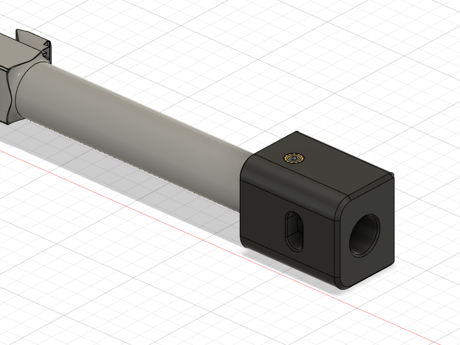
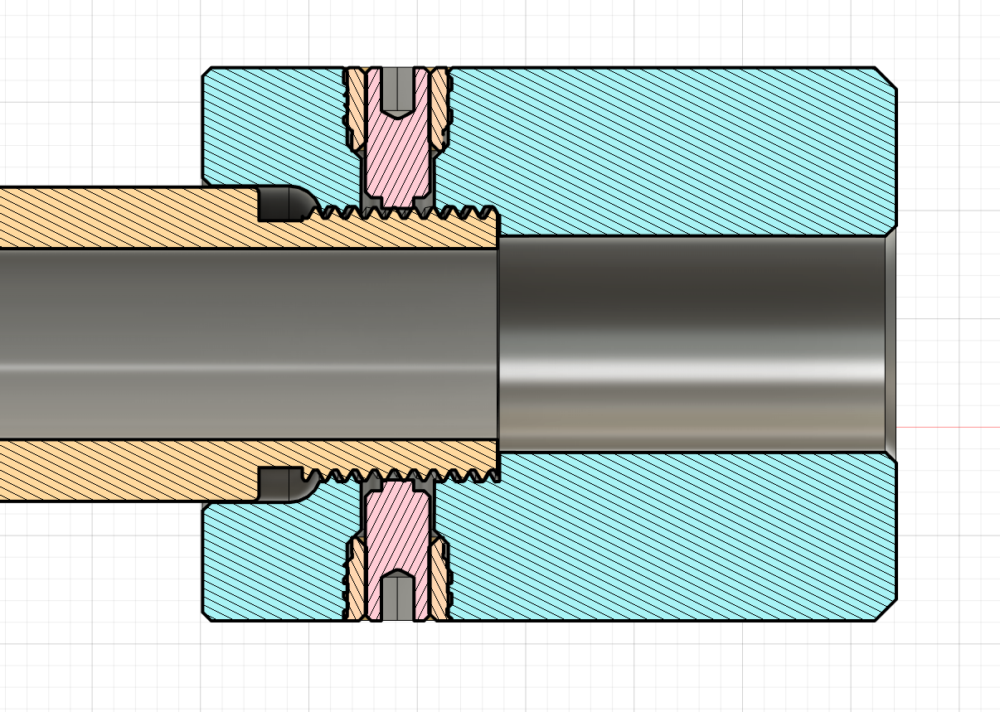
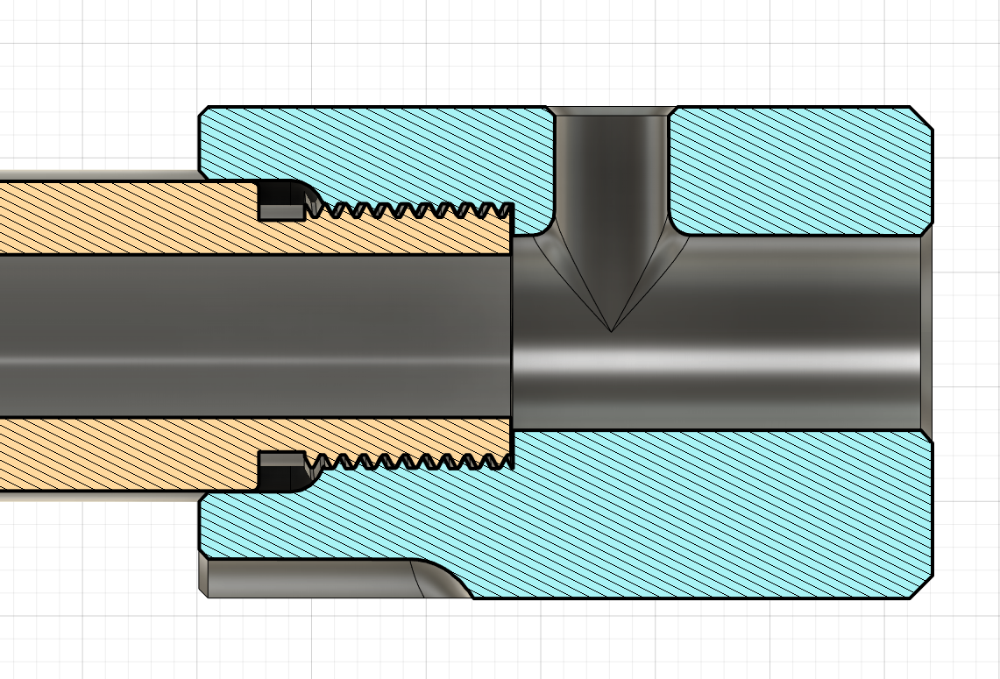

3D Printable muzzle brake for Glock
===================================

The 3D printable muzzle break that is designed to be fitted to Glock pistol with threaded barrel. Designed and tested on Faxon Glock 19 barrel with 1/2-28 thread. 

BOM
---
- 2x 3x5x4mm heatset inserts
- 2x 6mm set screws (nylon tip)

Print Parameter & Materials
- Test printed in Fusrock PAHTCF (high temperature carbon fiber nylon)
- 2x perimeters, 9999x top layers (solid internal)

Installation
------------
1. Test fit the part after print. Make sure the threads are engaged correctly. 
2. Anneal in enclosed cardboard box for 4-8 hours (80-100 deg C).
3. Press the heatset inserts to the printed part. 
4. Install the muzzle brake to the barrel with correct timing. The muzzle brake should seat about 1mm apart from the slide. 
5. Install set screws and press against the barrel/thread. 
6. Rack the slide to make sure the tip of the guide rod doesn't touch the brake. 

Previews
--------

